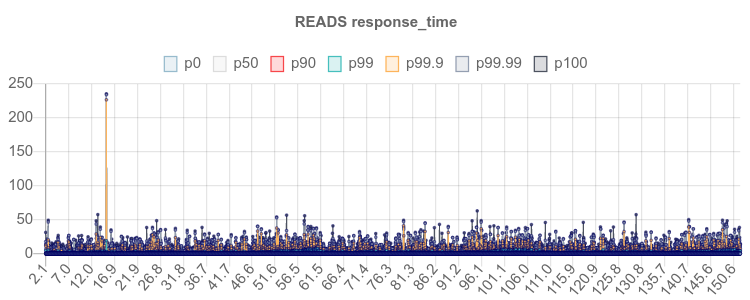
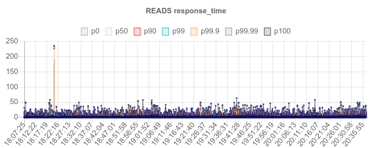
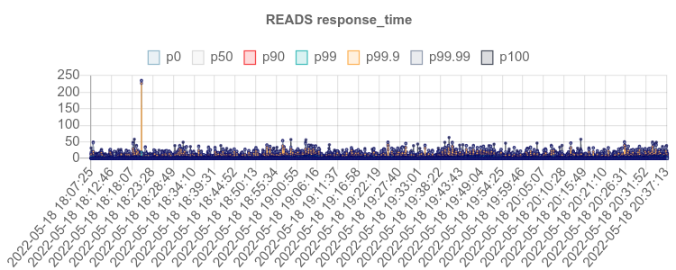
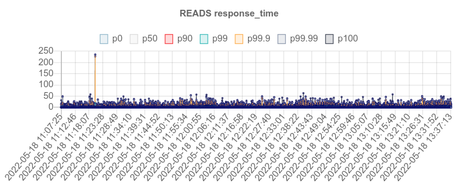
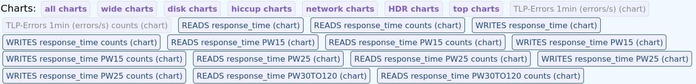
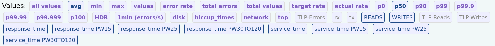

### ISV viewer server
#### Setup
Build:
```
$ cd isv-viewer/
$ mvn clean package -DskipTests
```
Run server as standalone springboot application:
```
$ java -jar target/isv-viewer-*.war
```
Or deploy WAR package to the web server (e.g. Tomcat):
```
$ cp target/isv-viewer-*.war ${CATALINA_HOME}/webapps/perf.war
```
#### Use
View results using following URL format: <br/>
http://localhost:8080/perf/#!?{options} or <br/>
http://server-hosting-results/perf/#!?{options} <br/>

options:

**&r** - "results" parameter, list of the results IDs (results in a database) or paths (result directories available on server side) <br/>
http://localhost:8080/perf/#!?r=id1,id2,id3,... <br/>
http://localhost:8080/perf/#!?r=path1,path2,path3,... <br/>

**&summary** - alternative summary result format <br/>
http://localhost:8080/perf/#!?summary&r=id1,id2,id3,... <br/>
http://localhost:8080/perf/#!?summary&r=path1,path2,path3,... <br/>

**&rec** - recursive processing of provided path to the results <br/>
http://localhost:8080/perf/#!?rec&r=path1 <br/>

**&show** - parameter for showing specific list of metrics which names matches to the given <br/>
http://localhost:8080/perf/#!?r=id1,id2,id3&show=metric_name1,metric_name2... <br/>
supported predefined values: <br/>
   **all** - show all metrics (charts and aggregate values) by default <br/>
   **allcharts** - show all charts but do not show aggregate values by default <br/>
   **allvalues** - show all value-based aggregate values by default <br/>

Show graphs in specific folders: <br/>
http://localhost:8080/perf/#!?A&show=allcharts&r=<path1>,<path2>,... <br/>

**&opts** - general options for displaying data
http://localhost:8080/perf/#!?r=id1,id2,id3&show=all&opts=opt1,opts2...
supported options:
noMin - do not use minimal metric time az start point (zero), keep absolute time
dateTime - show full date + time lables
utc - show date/time

#### Examples
   
default behavior:
   


opts=noMin
   

   
opts=noMin,dateTime
   

   
opts=noMin,dateTime,utc
   


**&search** - general options for searching results on filer in specified directory
http://localhost:8080/perf/#!?search=<nfs path>

#### Navigation

Use "Charts" section to show or hide charts of interest:
- use buttons with labels with bold fonts  to show/hide chart groups
- use buttons with labels (normal font) to show/hide specific charts
   


Use "Values" section to show or hide numeric values of interest:
- use buttons with labels with bold fonts  to show/hide values groups
- use buttons with labels (normal font) to show/hide specific values



### Examples

View example results from [examples](examples) included in the project:
   
http://localhost:8080/perf/#!?r=/local/path/to/tussle-benchmarks/isv-viewer/examples/res_omb_200k
   
http://localhost:8080/perf/#!?r=/local/path/to/tussle-benchmarks/isv-viewer/examples/res_omb_200k,/local/path/to/tussle-benchmarks/isv-viewer/examples/res_omb_1000k
