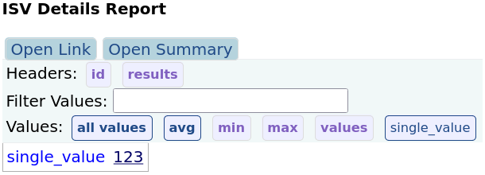

### ISV viewer server
#### Build
```
# build and install required Tussle Framework (https://github.com/AzulSystems/tussle-framework) in local maven (~/.m2) reprository
$ cd tussle-framework/
$ ./build.sh
# build ISV viewer server
$ cd tussle-benchmarks/isv-viewer/
$ mvn clean package -DskipTests
```
#### Run
Run server as standalone springboot application:
```
$ java -jar target/isv-viewer-*.war
```
Or deploy WAR package to the web server (e.g. Tomcat):
```
$ cp target/isv-viewer-*.war ${CATALINA_HOME}/webapps/perf.war
```
#### Use
View results using following URL format: <br/>
http://localhost:8080/perf/#!?{options} or <br/>
http://server-hosting-results/perf/#!?{options} <br/>

options:

**&r** - "results" parameter, list of the results IDs (results in a database) or paths (result directories available on server side) <br/>
http://localhost:8080/perf/#!?r=id1,id2,id3,... <br/>
http://localhost:8080/perf/#!?r=path1,path2,path3,... <br/>

**&summary** - alternative summary result format <br/>
http://localhost:8080/perf/#!?summary&r=id1,id2,id3,... <br/>
http://localhost:8080/perf/#!?summary&r=path1,path2,path3,... <br/>

**&rec** - recursive processing of provided path to the results <br/>
http://localhost:8080/perf/#!?rec&r=path1 <br/>

**&show** - parameter for showing specific list of metrics which names matches to the given <br/>
http://localhost:8080/perf/#!?r=id1,id2,id3&show=metric_name1,metric_name2... <br/>
supported predefined values: <br/>
   **all** - show all metrics (charts and aggregate values) by default <br/>
   **allcharts** - show all charts but do not show aggregate values by default <br/>
   **allvalues** - show all value-based aggregate values by default <br/>

**&search** - general options for searching results on filer in specified directory
http://localhost:8080/perf/#!?search=<nfs path>

#### Navigation

Use "Charts" section to show or hide charts of interest:
- use buttons with labels with bold fonts  to show/hide chart groups
- use buttons with labels (normal font) to show/hide specific charts
   


Use "Values" section to show or hide numeric values of interest:
- use buttons with labels with bold fonts  to show/hide values groups
- use buttons with labels (normal font) to show/hide specific values


Show graphs in specific folders: <br/>
http://localhost:8080/perf/#!?A&show=allcharts&r=<path1>,<path2>,... <br/>

**&opts** - general options for displaying data
http://localhost:8080/perf/#!?r=id1,id2,id3&show=all&opts=opt1,opts2...
supported options:
noMin - do not use minimal metric time az start point (zero), keep absolute time
dateTime - show full date + time lables
utc - show date/time

#### Metric format

Metrics are represented with Metric ([Tussle Framework -> Metric.java](https://github.com/AzulSystems/tussle-framework/blob/master/src/main/java/org/tussleframework/metrics/Metric.java)) and hashmap-based run properties:
```
HashMap<String, Object>;
class Metric {
    Long start;        // measurement start time in ms
    Long finish;       // measurement finish time in ms
    Long totalValues;  // total measured values (samples, requests, etc.)
    Integer delay;     // metric measurement interval length
    String name;       // response_time, service_time, etc. 
    String host;       // host or node name where metric was collected
    String units;      // metric measurement value units (ms, s, etc.) 
    String xunits;     // alternative metric X-axis units if it is not time-based
    String rateUnits;  // metric measurement rate units (op/s, msg/s, etc.)
    String operation;  // reads, writes, appends, end-to-end, etc.
    Double highBound;  // optional target rate high-bound value which used for iterative scenarios, e.g. run at target rates from 50% to 110% of high-bound 
    Double targetRate; // target rate
    Double actualRate; // measured actual rate
    Double value;      // metric value in case if it is single-value
    ArrayList<MetricValue> metricValues; // metric values - array of typed values arrays
}
```
Most Metric fields are optional. At least one of 'value' or 'metricValues' should be included in results metrics in order to be meaningful.

Metrics results in JSON format includes run configuration properites and arrey of Metric:
```
{
  "doc" : {
    "runProperties" : { "prop": "value", ... }
    "metrics" : [ // array of Metric:
    {
      "start" : number,
      "finish" : number,
      "delay" : number,
      "name" : string,
      "host" : string,
      "units" : string,
      "xunits" : string,
      "rateUnits" : string,
      "operation" : string,
      "value" : number,
      "metricValues" : [ // array of MetricValue:
        { "type" : "VALUES", "values" : [val1,val2,val3,...] }
        { "type" : "OTHER_VALUES", "values" : [valA,valB,valC,...] }
        ...
      ]
    }
    ...
    ]
```

Metrics results in CSV format:
```
header
row1
row2
...
```

#### Examples

1. "Single value" metric [examples/single_value/metrics.json](examples/single_value/metrics.json):
```
{
  "doc" : {
    "metrics" : [ {
      "name" : "single_value",
      "value" : 123
    } ]
  }
}
```
View example in ISV viewer: 
http://localhost:8080/perf/#!?r=/local/path/to/tussle-benchmarks/isv-viewer/examples/single_value

Expected result:



2. "Simple values" metric [examples/simple_values/metrics.json](examples/simple_values/metrics.json):
```
{
  "doc" : {
    "metrics" : [ {
      "name" : "simple_values",
      "metricValues" : [ {
        "type" : "VALUES",
        "values" : [ 1, 2, 3, 4, 5, 4, 3, 2, 1, 2, 3, 4, 5, 4, 3, 2, 3, 4, 3, 2, 1 ]
      } ]
    } ]
  }
}
```
View example in ISV viewer: 
http://localhost:8080/perf/#!?r=/local/path/to/tussle-benchmarks/isv-viewer/examples/simple_values

Expected result:


3. "Mixed values" metric [examples/mixed_values/metrics.json](examples/mixed_values/metrics.json):
```
{
  "doc" : {
    "metrics" : [ {
      "name" : "mixed",
      "units" : "UNIT",
      "metricValues" : [ {
        "type" : "VALUES",
        "values" : [ 1, 2, 3, 4, 5, 4, 3, 2, 1, 2, 3, 4, 5, 4, 3, 2, 3, 4, 3, 2, 1 ]
      }, {
        "type" : "OTHER_VALUES",
        "values" : [ 13, 11, 13, 11, 19, 15, 13, 12, 11, 12, 11, 12, 17, 14, 13, 12, 13, 14, 13, 12, 11 ]
      }, {
        "type" : "MORE_VALUES",
        "values" : [ 23, 22, 23, 21, 21, 21, 23, 22, 21, 22, 21, 22, 21, 28, 21, 22, 23, 29, 21, 22, 25 ]
      } ]
    }, {
      "name" : "fibonacci",
      "metricValues" : [ {
        "type" : "VALUES",
        "values" : [ 0, 1, 1, 2, 3, 5, 8, 13, 21, 34, 55, 89, 144, 233, 377, 610, 987 ]
      } ]
    }, {
      "name" : "value_a",
      "value" : 555
    }, {
      "name" : "value_b",
      "units" : "op/s",
      "value" : 77
    }, {
      "name" : "value_c",
      "units" : "ms",
      "value" : 0.123
    } ]
  }
}
```
View example in ISV viewer: 
http://localhost:8080/perf/#!?r=/local/path/to/tussle-benchmarks/isv-viewer/examples/mixed_values

Expected result:


4. "Disk utilization" metric [examples/disk_util/metrics.json](examples/disk_util/metrics.json):
```

  "doc" : {
    "runProperties" : {
      "start_time" : "2023-03-21T18:50:23",
      "vm_type" : "OpenJDK 64-Bit Server VM",
      "osInfo" : [ {
        "Arch" : "amd64",
        "Version" : "4.15.0-204-generic",
        "User Name" : "user",
        "Name" : "Linux"
      } ],
      "finish_time" : "2023-03-21T18:50:23"
    },
    "metrics" : [ {
      "start" : 1676484562483,
      "finish" : 1676484977483,
      "delay" : 5000,
      "name" : "disk",
      "host" : "node1-m6a.xlarge",
      "units" : "%util",
      "operation" : "%util",
      "metricValues" : [ {
        "type" : "VALUES",
        "values" : [ 0.16, 2.83, 2.36, 0.08, 34.84, 0.58, 0.52, 0.16, 0.1, 0.06, 0.06, 0.08, 0.16, 0.5, 0.22, 0.08, 0.06, 0.08, 0.06, 0.24, 0.14, 0.1, 0.08, 0.3, 0.06, 0.18, 0.1, 0.06, 0.04, 0.06, 0.04, 0.16, 0.16, 0.1, 0.06,
      } ]
    } ]
  }
}

```
View example in ISV viewer: 
http://localhost:8080/perf/#!?r=/local/path/to/tussle-benchmarks/isv-viewer/examples/disk_util

Expected result:


5. Search results from [examples](examples) included in the project:
  
http://localhost:8080/perf/#!?search=/local/path/to/tussle-benchmarks/isv-viewer/examples

6. View OpenMessaging Benchmark (OMB) result from [examples](examples) included in the project:
   
http://localhost:8080/perf/#!?r=/local/path/to/tussle-benchmarks/isv-viewer/examples/omb_200k

7. Compare two OpenMessaging Benchmark (OMB) results from [examples](examples) included in the project:
   
http://localhost:8080/perf/#!?r=/local/path/to/tussle-benchmarks/isv-viewer/examples/omb_200k,/local/path/to/tussle-benchmarks/isv-viewer/examples/omb_1000k

8. Default relative timeline:


9. Timeline with abs time (opts=noMin)
   

   
10. Timeline with abs datetime (opts=noMin,dateTime)
   

  
11. Timeline with abs UTC datetime (opts=noMin,dateTime,utc)


